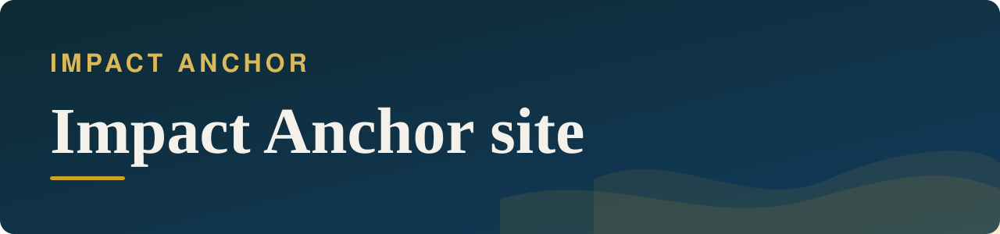
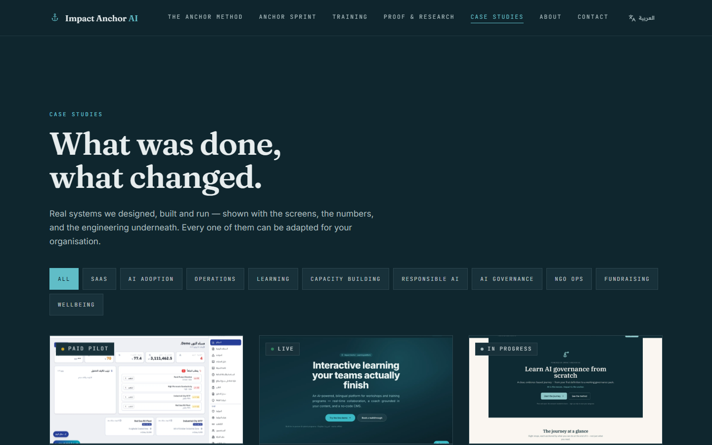

<b>Status:</b> Live · final updates in progress &nbsp;·&nbsp; <b>Built by</b> <a href="https://github.com/Mohanad1st">Mohannad Hesham</a> &nbsp;·&nbsp; <b>Source:</b> private

من الارتباك أمام الذكاء الاصطناعي إلى خطة تبنٍّ واضحة

> **This is a showcase, not the code.** The source is private because it is a live business site with its own admin area. This page shows what it does and how it was built, not the code itself. A live walkthrough is available on request.

## The problem

Organisations across the Gulf and MENA want to use AI but are stuck between hype and fear. This is the site for Impact Anchor, my AI and evidence advisory practice: a clear method, case studies with real screens and numbers, training, and a short way to start — with no prices and no checkout, because the right first step is a conversation.

## What it does

- A bilingual site explaining a structured AI-adoption method
- Case studies with the challenge, approach, outcome and the screens behind them
- Training and speaking pages
- An assistant that answers visitors' questions from the site's own content
- Spam-protected contact and a book-a-call flow
- An admin area for publishing content

## See it

**[Visit impact-anchor-ai.com →](https://www.impact-anchor-ai.com)**

 Case studies page

All screens show demo data or public pages only.

## Built with

React · TypeScript · PostgreSQL with auth and storage · serverless functions · deployed on managed hosting

## Built responsibly

- Role-based access for the admin area
- Row-level security limits what the public can read or write
- Security headers applied site-wide
- Only public keys ever reach the browser
- Tests, lint and build checks run before changes ship

## What it deliberately doesn't do

- There is no pricing or checkout on purpose.

## More from Impact Anchor

- [ImpactAnchor Reels](https://github.com/Mohanad1st/impactanchor-reels-showcase) — Recorded sessions in; scored, subtitled, scheduled short videos out
- [AI Governance Roadmap](https://github.com/Mohanad1st/ai-governance-roadmap-showcase) — A free, bilingual course that takes you from first definitions to a governance plan
- [Anchor Learning Hub](https://github.com/Mohanad1st/anchor-learning-hub-showcase) — Interactive, bilingual, offline-ready learning for workshops and training programmes
- [Network Intelligence](https://github.com/Mohanad1st/network-intelligence-showcase) — Relationships, opportunities and content in one self-hosted workspace

---

© 2026 Mohannad Hesham. Showcase text and images only — no source code is published or licensed here. See all my work on <a href="https://github.com/Mohanad1st">my GitHub profile</a> · <a href="https://www.linkedin.com/in/mohannadhesham/">LinkedIn</a>.
